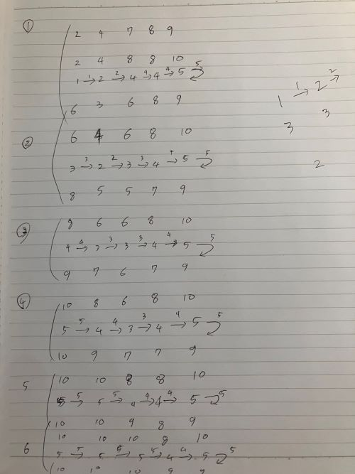

The candy war (BOJ_9037)
---

- 문제 : [9037. The candy war](https://www.acmicpc.net/problem/9037)
- 날짜 : 2024-09-23
- 작성자 : 김찬호

# 문제

알고리즘 유치원 선생님인 영희는 간식시간이 되자 아이들에게 사탕을 나누어 주려고 하였다. 하지만 욕심 많고 제멋대로인 유치원 아이들은 차례대로 받으라는 선생님의 말을 무시한 채
마구잡이로 사탕을 집어 갔고 많은 사탕을 집어 간 아이가 있는가 하면 사탕을 거의 차지하지 못하고 우는 아이도 있었다.

말로 타일러도 아이들이 말을 듣지 않자 영희는 한 가지 놀이를 제안했다. 일단 모든 아이들이 원으로 둘러 앉는다. 그리고 모든 아이들은 동시에 자기가 가지고 있는 사탕의 절반을
오른쪽 아이에게 준다. 만약 이 결과 홀수개의 사탕을 가지게 된 아이가 있을 경우 선생님이 한 개를 보충해 짝수로 만들어 주기로 했다. 흥미로워 보이는 이 놀이에 아이들은 참여
했고 이 과정을 몇 번 거치자 자연스럽게 모든 아이들이 같은 수의 사탕을 가지게 되어 소란은 종료되었다.

자기가 가진 사탕의 반을 옆에 오른쪽에 앉은 아이에게 주는 과정과 선생님이 사탕을 보충해 주는 과정을 묶어서 1 순환이라고 할 때 몇 번의 순환을 거치면 모든 아이들이 같은 수의
사탕을 가지게 되는지 계산 해보자. 단, 처음부터 홀수개의 사탕을 가지고 있으면 선생님이 짝수로 보충을 먼저 해주며 이 경우 순환수에 들어가지 않는다. 선생님은 충분한 수의 사탕을
갖고 있다고 가정하자.

### 입력

입력은 표준입력(standard input)을 통해 받아들인다. 입력의 첫 줄에는 테스트 케이스의 개수 T가 주어진다. 각각의 테스트 케이스의 첫 줄에는 아이의 인원 N (1 ≤
N ≤ 10)이 주어지고 그 다음 줄에는 각 아이들이 초기에 가지고 있는 사탕의 개수 Ci ( 1 ≤ i ≤ N, 1 ≤ Ci ≤ 30)가 주어진다. 분배 시 C1의 오른쪽에는
C2가, C2의 오른쪽에는 C3가…… 같은 식으로 앉게 되며 CN의 오른쪽에는 C1이 앉게 된다.

### 출력

출력은 표준출력(standard output)을 통하여 출력한다. 각 테스트 케이스에 대하여 모든 아이가 같은 개수의 사탕을 가질 때까지 몇 순환이 걸리는지 출력하시오.

### 예제 입력 1

```plaintext
4
5
2 4 7 8 9
1
9
6
10 5 13 2 7 8
4
3 4 4 3
```

### 예제 출력 1

```plaintext
6
0
4
0
```

<br />

---

# 풀이

### 문제 조건

- 원으로 둘러 앉는다 => 순환 구조 => 모듈러 연산
- 단, 처음부터 홀수개의 사탕을 가지고 있으면 선생님이 짝수로 보충을 먼저 해주며 이 경우 순환수에 들어가지 않는다.

### 문제 접근

- 먼저 홀수를 짝수로 만든다.
- 캔디를 반으로 나누고 다음 캔디에 저장한다.
- 모든 캔디 개수가 같으면 루프 종료 (반으로 잘라도 같은 경우 = 원래 개수도 같음)
- 나눈 캔디를 더해준다. (모듈러연산)
  <br /><br />

### 구현코드

```java
int[] dividedCandy = new int[N];
  for (int j = 0; j < N; j++) {
    // 홀수인 경우 짝수로 만들어줌
    if(myCandy[j] % 2 == 1){
      myCandy[j]++;
    }
  // 캔디를 반으로 나누고 다음 캔디에 저장
  myCandy[j] /= 2;
  dividedCandy[(j + 1) % N] = myCandy[j];
}
```

```java
// 모든 캔디 개수가 같으면 루프 종료
boolean isAllSame = Arrays.stream(myCandy).allMatch(c -> myCandy[0] == c);
if(isAllSame){
  sb.append(count).append("\n");
  break;
}
```

```java
  // 나눈 캔디를 더해줌
  for (int j = 0; j < N; j++) {
    myCandy[j] += dividedCandy[(j + 2) % N];
  }
```

### 참고

- 모듈러 연산 : 나누기 연산을 한 후 나머지 값을 구하는 연산 ([링크](https://visualize.tistory.com/269))
- 수기 풀이
 
